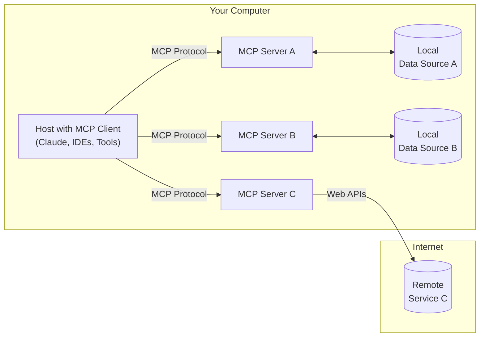

# MCP 

```mermaid

---

config:

theme: neutral

look: classic

layout: dagre

---

flowchart LR

subgraph Computer["Your Computer"]

Client["Host with MCP Client<br>(Claude, IDEs, Tools)"]

ServerA["MCP Server A"]

ServerB["MCP Server B"]

ServerC["MCP Server C"]

DataA[("Local<br>Data Source A")]

DataB[("Local<br>Data Source B")]

end

subgraph Internet["Internet"]

RemoteC[("Remote<br>Service C")]

end

Client -- MCP Protocol --> ServerA & ServerB & ServerC

ServerA <--> DataA

ServerB <--> DataB

ServerC -- Web APIs --> RemoteC

```

