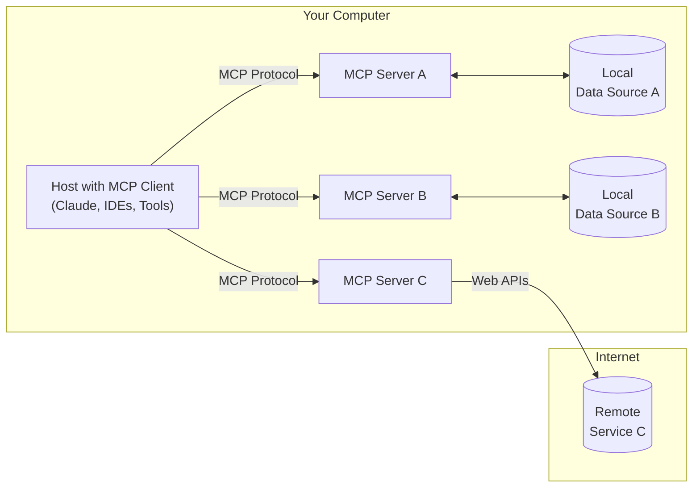

# MCP 

The motivation behind MCP is the core concept that models are only as good as the context we provide. This seems obvious now, but a year ago, when most AI applications were chatbots, you’d bring in context by copy-pasting or typing from other systems. Over the past year, we’ve seen these evolve into systems where the model has hooks into data and context, making it more powerful and personalized.

We can think of MCP like an API. This is not a perfect analogy, but a useful one to start with. APIs standardize how web applications connect the front end to the back end. They act as a layer that translates requests between them, giving the front end access to servers, databases, and services.

MCP standardizes how AI applications interact with external systems through three core interfaces: prompts, tools, and resources.

The world with MCP is a world of standardized AI development.
Applications like Curser and Windsurf, agents like Goose — all of these are MCP clients. There’s now a standard interface for any of these client applications to connect to any MCP server with zero additional work.

An MCP server is a wrapper — a way of federating access to systems and tools relevant to the application. It could be a database the LLM can query to fetch records. It could be a CRM like Salesforce, where you want to read and write to something hosted remotely but accessible to the LLM. It could even be things on your local system, like version control and Git, where you want the LLM to connect to APIs running on your own machine.

I think the right way to frame this is that MCP creates different kinds of value for different people. There are four main buckets:

For application developers, once your client is MCP-compatible, you can connect it to any server with zero extra work. 

If you’re a tool or API provider—or anyone who wants to give LLMs access to relevant data—you build your MCP server once and instantly get adoption across a range of AI applications.

For end users, this unlocks richer, more powerful AI systems. You’ve probably seen demos—whether it’s Cursor, WindSurf, or even our own first-party apps—where these systems have deep context, know things about you, and can act on your behalf in the real world.

For enterprises, MCP introduces a clean way to separate concerns. Say one team owns the data layer and another team is building AI products. In the pre-MCP world, every team would implement its own access method, including prompt logic and chunking to get the data they need and process into their AI application. 

With MCP, that data team builds and maintains a single MCP server. They publish the interface, document it, and every other team can plug into it. Teams move faster, and the organization operates more like a modern microservices architecture—each team owns their piece, and the whole roadmap accelerates.

On the left, there’s the MCP client. It invokes tools, queries resources, and interpolates prompts—filling them with useful context for the model. On the server side, the server builder exposes these components—tools, resources, and prompts—in a way that any MCP-compatible client can consume.

Tools are maybe the most intuitive. A tool is model controlled. And this is a key shift. In traditional LLM setups, developers define their own tools—usually as Python functions—and register them with the LLM runtime. The model then selects from this local set of tools. But with MCP, that assumption is flipped: the tools are not local functions, but remote APIs exposed by a server. The client application doesn’t necessarily know how the tool works internally—it only knows the server has exposed a tool and provided metadata like its name, parameters, and expected output. The model can choose to call that tool, but the logic itself lives on the server, not in the client’s codebase.
The server exposes tools to the client, and the LLM in that client chooses the best time to invoke them. If you’ve used MCP-compatible agent systems, the tools are typically interpolated into the prompt. The server provides descriptions of each tool, and the model decides when to call them.

These tools can do pretty much anything—read data, write to apps, update databases, write files to your local file system. The possibilities are endless.

Resources are application controlled. This means they’re not defined inside the client’s codebase. The server owns them. The application decides which resources to attach—but it doesn’t create or define the actual resource. For example, the server might expose a list of database queries or log files. These are available via `resources/list`, and the application decides, based on logic or user action, which of those to fetch and attach.
They’re data exposed to the application. The server can generate or expose resources:images, text files, JSON logs tracking prior actions, and the application decides how to use them.

Resources create a richer interface than just chatting with a bot. I've seen use cases where a server surfaces static files or dynamic ones, where the app sends info about the user or file system and the server generates complex data in return. In Claude for Desktop, resources show up as attachments. Users can click in the UI, select a resource, and attach it to the chat—or the model can auto-attach a relevant one.

Finally, prompts are user-controlled. I think of them as user-invoked tools. These are templates for common interactions with a server. One example I like is in the IDE called Zed. You can type something like /ghpr plus the PR ID, and Zed expands it into a full predefined prompt in the MCP server that gets sent to the LLM.

Other use cases: teams standardizing document Q&A workflows—things like formatting rules, transcripts with speaker tags, etc. These live in the server as prompts, and the user chooses when to invoke them.

### Why do we need resources when we have tools? 

A question I really struggled with was: why do we need resources when we already have tools—aren’t both just ways of injecting more context into the model?

In both cases we’re enriching the model’s context window. Whether the model calls a tool, which might hit a weather API or database query and return that into the prompt, or whether the application attaches a resource like a file or JSON log, the end result is that the model gets more context to work with.

The key difference is who’s in control.

Tools are model-controlled. The server exposes them, but the model decides when and how to call them.

Resources are application-controlled. The app is aware—programmatically—of what resources are available from the server. It can have logic baked in to decide which ones to surface based on user behavior or internal app state.

A big part of the thinking behind MCP, at least from my perspective, is that it’s not just about making the model better, it’s about defining how the application itself interacts with the server in richer ways.

You might wonder: If the server owns the data—say a Postgres or BigQuery database—how can the client decide what data gets sent to the model?

Here’s how it works. The server defines a set of parameterized queries—think Jinja-style templates like `SELECT * FROM orders WHERE date > {{ start_date }}`—and exposes these as resources. When the client asks the server for a list of resources, it receives a list of available query templates, often with human-readable names like “Recent Orders” or “Top Customers (Last 30 Days).” The app can then render these to the user, who selects a resource and fills in any required parameters (like the date range or customer ID). The app calls `resources/read` with the selected template and parameters. The server runs the query, serializes the result as a JSON blob, and returns it to the client. Finally, the client decides whether to attach that result to the chat as a resource—giving the model direct access to structured, vetted data, without ever exposing raw database access.

Part of the question is: aren’t resources and prompts static? Can’t they just be embedded in a tool? In reality, resources and prompts in MCP can be dynamic. They can be interpolated with context from the user or the application. The server can return a customized resource or prompt depending on the task.

One valuable feature is resource notifications. The client can subscribe to a resource, and anytime the server updates it with new info, the server pushes a notification to the client—telling it to update system state or surface new information to the user.

Yes, you can do a lot with just tools, but MCP isn’t just about feeding the model more context. It’s about giving the application richer ways to interact with whatever the server is exposing. It’s not just a standard way to invoke tools.

Example/Idea: At StatsCan, imagine surfacing prebuilt prompts for survey metadata exploration or releasing resource endpoints that auto-update when new Census microdata drops. You could build a client that notifies analysts when new microdata snapshots become available, without having to rewire the whole interface.

### Sampling
This idea can sound a bit weird or confusing at first. Honestly, I’m still a bit skeptical about it.
Most tutorials and videos on Model Context Protocol don’t even mention sampling. 

Sampling lets the server request completions from the client, but the client retains full control—over model choice, cost, privacy, and even whether to reject the request. This flips the usual power dynamic: the server asks for inference, but the client runs it.

Antrophic says this becomes useful in cases where the server wants intelligence but doesn’t control the model directly. For example, it might say: “Hey, use this system prompt and this model if you can. Here’s the task prompt. Also, try to keep the temperature low and don’t go over 500 tokens.” The client can honor those preferences—or not. It can block malicious requests or enforce limits.

# why do they have to be MCP servers as opposed to just a regular HTTP server? 

The answer in this case for composability and the layered approach is that each of these can be agents. In the system that I’m talking about here, there are reasons for protocol capabilities resource notifications, server to client communication, the server requesting more information from the client that are built into the MCP protocol itself so that each of these interactions are more powerful than just data passing between different nodes. let’s say each of these are agents, the first agent can ask the next agent for a specific set of data, does asynchronous work, talks to the real world, brings it back and sends that back to the first client, which might be multi-step, it might take multiple interactions between each of those two nodes. That’s a more complex interaction that’s captured within the MCP protocol that might not be captured if it were just regular HTTP servers.

Example/Idea: At Statistics Canada AI division, an MCP server could coordinate asynchronous record linkage tasks between T1 tax data and the Business Register, handling multi-step queries and data reconciliation.